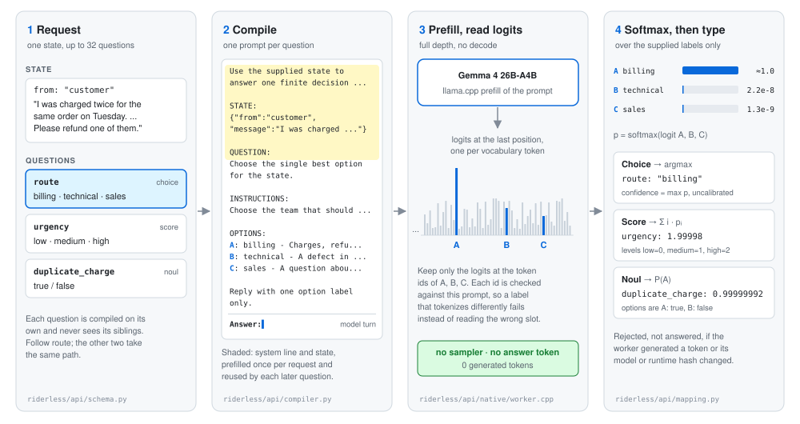
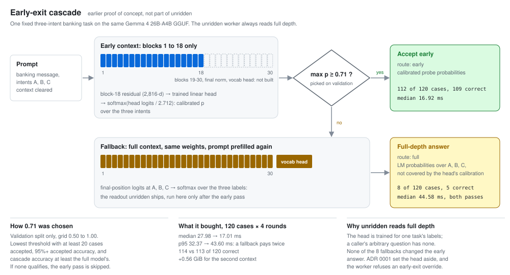

# riderless

A local decision API that answers structured questions by reading logits, with
zero generated tokens. You supply a `state` and a named map of questions; the
service returns one typed answer per question: a Choice, a Score, or a Noul
(true/false probability).

It is not a chat model, not a text generator, and not a drop-in replacement for
a hosted service. It runs one llama.cpp child process on your own machine,
answers one request at a time, and never samples or appends a token.

## Why riderless

Jonathan Haidt describes the mind as a rider on an elephant: the elephant is the
fast, automatic part that actually moves, and the rider is the conscious
narrator who explains afterwards where they were going (The Happiness
Hypothesis, 2006, reused in The Righteous Mind). The elephant is roughly what
Kahneman calls System 1. This API reads the decision straight off the model's
final-position logits and never lets it narrate: no explanation, no
after-the-fact story, zero generated tokens. The name is a label for that design
choice, not a claim about how the model works inside.

## The three question types

A request names the model, one state (a string or any JSON value), and up to 32
questions. Question ids are yours; they are correlation metadata and never reach
the prompt.

```json
{
  "model": "local-gemma-riderless-v1",
  "state": {"message": "The card was charged twice"},
  "questions": {
    "route": {
      "type": "choice",
      "instructions": "Choose the best route",
      "criteria": {"billing": null, "technical": "A software defect"}
    },
    "severity": {
      "type": "score",
      "instructions": null,
      "criteria": ["low", "medium", "high"]
    },
    "duplicate": {
      "type": "noul",
      "instructions": "The state describes a duplicate charge"
    }
  }
}
```

The response carries one answer per question id. Choice returns the argmax
option and the full distribution. Score returns the zero-based expected value
`sum(i * p_i)`, so label probabilities `[0.2, 0.3, 0.5]` give `1.3`. Noul returns
only `P(true)`.

```json
{
  "model": "local-gemma-riderless-v1",
  "answers": {
    "route": {
      "type": "choice",
      "choice": "billing",
      "probabilities": {"billing": 0.8, "technical": 0.2},
      "confidence": 0.8
    },
    "severity": {
      "type": "score",
      "score": 1.3,
      "legend": {"0": "low", "1": "medium", "2": "high"},
      "probabilities": {"0": 0.2, "1": 0.3, "2": 0.5},
      "confidence": 0.5
    },
    "duplicate": {"type": "noul", "noul": 0.9}
  },
  "usage": {"input_tokens": 384, "output_tokens": 0}
}
```

Limits: Choice takes 2 to 255 options at the wire boundary and is then rejected
above the backend's validated label capacity (26); Score takes 2 to 10 levels;
Noul needs instructions or a true/false rubric. `output_tokens` is always 0.

## How it works



Each question is compiled into its own prompt from the state plus that
question's own instructions and criteria, with its options labelled `A`, `B`,
`C` and so on. The worker prefills that prompt and reads the final-position
logits at the validated single-token label ids, then softmaxes over those labels
only. There is no sampler, no answer token, no autoregressive loop. The label
alphabet is A to Z, which caps a question at 26 options, and the default context
is 2048 tokens (`--context`).

A question never sees its siblings, so anything a question depends on must be in
the state or in that question's own instructions. Within one request the text
every question shares (the system instruction and the state) is prefilled once:
the first question prefills its whole prompt, and each later question trims the
context back to the shared prefix and prefills only its own remainder. The split
point is computed from the question's own prompt alone and the prefix is reused
only on exact token equality, so a question is computed identically alone,
reordered, or beside any siblings. Nothing is cached between requests.

Questions are still evaluated one at a time by default; the request is not a
single combined forward pass. See
[docs/decisions/0002](docs/decisions/0002-share-state-prefix-within-a-request.md)
for why, and for the cost of the alternative. An opt-in worker mode
(`--batched`) does evaluate a request's questions in one batched decode, which
is faster and gives up that sibling independence:
[docs/decisions/0004](docs/decisions/0004-optional-batched-question-evaluation.md)
and [docs/results/batched-mode.md](docs/results/batched-mode.md).

Riderless always reads the full depth of the model. An earlier proof of concept
exited at block 18 of 30 with a head trained for one three-class task, and fell
back to a full pass below a confidence threshold. It was set aside for the
general API ([ADR 0001](docs/decisions/0001-full-depth-label-readout-in-an-owned-child.md));
the [whitepaper](docs/whitepaper.md) has the numbers.



## Requirements

- An NVIDIA GPU with about 18 GiB free (16 GiB of weights plus KV and compute
  buffers at the default 2048-token context), or CPU if you are patient.
- Linux on x86_64, glibc 2.39 or newer (Ubuntu 24.04 and later). WSL2 counts;
  native Windows and macOS do not. The published worker bundles are built on
  Ubuntu 24.04, so glibc 2.39 is the floor for them; a source build only needs
  a toolchain that can compile llama.cpp.
- Python 3.12 or newer. A source build also needs Git, CMake, a C++ toolchain
  and, for a GPU, the CUDA toolkit. Nothing from llama.cpp is vendored; the
  build script fetches and compiles the tested release, `v0.4.1`.
- For the prebuilt `cuda13` bundle, an NVIDIA driver of 580.65 or newer; for
  `cuda12`, 525.60 or newer. The bundle carries its own `libcudart`,
  `libcublas` and `libcublasLt`, so no CUDA toolkit is needed to run it. The
  one system library every bundle needs is OpenMP's `libgomp.so.1`
  (`libgomp1` on Debian and Ubuntu, `libgomp` on Fedora), which a desktop
  install already has and a minimal container may not.
- 17 GB of disk for the Gemma 4 26B-A4B GGUF, which you download yourself
  under its own licence terms; it is not redistributed here. A cuda13 worker
  bundle is a further ~450 MB, most of it NVIDIA's cuBLAS.

## Quick start

Four commands from a clone to a first answer, no compiler needed. Budget about
twenty minutes, nearly all of it the 17 GB model download.

```bash
# 1. Install. Needs Python 3.12+. (No uv? `python -m venv .venv &&
#    .venv/bin/pip install -e .` and drop the `uv run` prefix.)
uv sync

# 2. Download a prebuilt worker. Picks cuda13, cuda12 or cpu from your NVIDIA
#    driver and says which; --flavor overrides it. The download is checked
#    against the release's SHA256SUMS, and against GitHub's build provenance
#    when `gh` is installed (--require-attestation makes that mandatory).
uv run python -m riderless.api.cli worker fetch --output build/api-worker

# 3. Download the model into models/ (17 GB, Apache-2.0, not gated).
uv run --with huggingface_hub hf download unsloth/gemma-4-26B-A4B-it-GGUF \
  gemma-4-26B-A4B-it-UD-Q4_K_XL.gguf --local-dir models

# 4. Answer the bundled hello request.
uv run python -m riderless.api.cli run \
  --input riderless/examples/hello.json --output hello-answers.jsonl --gpu
```

`hello.json` is a customer message ("I was charged twice for the same order")
with one question of each type: which team should handle it, how urgent it is,
and whether it reports a duplicate charge. On an RTX 5090 the command takes
about 11 seconds, nearly all of it loading the model, and writes:

```json
{
  "model": "local-gemma-riderless-v1",
  "answers": {
    "route": {"type": "choice", "choice": "billing",
              "probabilities": {"billing": 0.99999998, "technical": 2.2e-08, "sales": 1.3e-09},
              "confidence": 0.99999998},
    "urgency": {"type": "score", "score": 1.99998,
                "legend": {"0": "low", "1": "medium", "2": "high"},
                "probabilities": {"0": 4.9e-07, "1": 2.4e-05, "2": 0.99998},
                "confidence": 0.99998},
    "duplicate_charge": {"type": "noul", "noul": 0.99999992}
  },
  "usage": {"input_tokens": 417, "output_tokens": 0}
}
```

(Probabilities abbreviated; the file carries full precision. Those confidences
are typical and are not calibrated; see [Limitations](#limitations).)

To serve it over HTTP instead:

```bash
uv run python -m riderless.api.cli serve --gpu --host 127.0.0.1 --port 8090
curl -s http://127.0.0.1:8090/health
curl -s -X POST http://127.0.0.1:8090/v1/decisions \
  -H 'content-type: application/json' --data @riderless/examples/hello.json
```

Or in a container, which carries the cuda13 worker and expects your GGUF
mounted at `/models`. It needs the NVIDIA container toolkit and a CUDA 13
driver:

```bash
docker run --gpus all -p 8090:8090 -v "$PWD/models:/models:ro" \
  ghcr.io/potto007/riderless:latest-cuda13
```

Step 4 and `serve` use `ApiConfig`'s defaults for the worker
(`build/api-worker/build/riderless-worker`), the manifest
(`build/api-worker/build.json`) and the model
(`models/gemma-4-26B-A4B-it-UD-Q4_K_XL.gguf`); pass `--worker`, `--manifest`
and `--model-path` to use another layout. `run` accepts one JSON object, a JSON
array, or JSONL, and `--diagnostics` adds the per-question readout described
below.

A downloaded worker is verified exactly as a compiled one is. Startup re-hashes
the executable, every runtime library and the model, and refuses to start on
any mismatch; the download adds the `SHA256SUMS` and attestation checks on top
of that, and removes the compiler, not a check. See
[ADR 0005](docs/decisions/0005-relocatable-prebuilt-worker-bundles.md).

One caveat on the published binaries: every number in `docs/results/` was
measured on a native build for one GPU architecture. The release bundles are
built with `GGML_NATIVE=OFF` and `CMAKE_CUDA_ARCHITECTURES=80;86;89;90;120`, a
different compile, so a prebuilt worker is not promised to reproduce those runs
bit for bit. Measured for the 0.2.0 `cuda13` bundle on an RTX 5090: 10 of
1,286 suite answers differ from the native reference run and overall accuracy
is 0.928 against 0.931, which is the same band the batch-size and
llama.cpp-revision controls already showed. Answers stay deterministic per
configuration; they are not identical across configurations. Build from source
if you need the exact configuration the results pages describe.

### Build details

Building from source replaces step 2 and takes about ten minutes. It needs
Git, CMake, a C++ toolchain and, for `--cuda`, the CUDA toolkit.

```bash
# Replace 120 with your GPU's compute capability (120 is an RTX 5090; 89 is a
# 4090). Drop --cuda for CPU only.
uv run python scripts/riderless/build_base_runtime.py \
  --out build/llama-base --cuda --cuda-architectures 120
uv run python -m riderless.api.native.build \
  --base build/llama-base --output build/api-worker
```

`build_base_runtime.py` clones llama.cpp at the tested release (`v0.4.1`,
commit `b29c606e28a01b1bc8c1351026a0fa6e616bf6c4`), verifies the tag still
resolves to that commit, builds the shared libraries, and writes `build.json`
with the revision and a hash of every file. `--revision <tag-or-sha>` builds
another revision (the service then warns once at startup that the published
numbers were measured on the tested one), `--llama-source <clone>` reuses a
clone you already have, and `--jobs` caps the compile. Without `--cuda-architectures`
llama.cpp builds every architecture it knows, which costs time and memory you
do not need to spend. `--no-native` drops `-march=native`, which is what the
published builds use and what you want if the result has to run anywhere but
this machine. A CUDA build also copies `libcudart`, `libcublas` and
`libcublasLt` in beside the backend so the result needs only a driver;
`--no-cuda-redist` skips that.

`riderless.api.native.build` compiles the worker against that runtime, runs the
worker's CPU unit test, copies the runtime libraries in beside the executable,
and records every input hash in its own `build.json`. The output directory must
not already exist; delete it to rebuild. No model is loaded and no GPU work
happens in either build step. At startup the service re-hashes the worker, the
runtime files and the model, and refuses to start if any differ from the
manifest.

Either route produces the same bundle, and it names no path outside itself:

```
build/api-worker/build.json                the manifest, schema 2
build/api-worker/build/riderless-worker    the executable
build/api-worker/runtime/*.so*             the libraries it links and dlopens
```

`python -m riderless.api.native.bundle pack|unpack` moves one between machines,
and that is what the release workflow publishes. A worker directory built
before 0.2.0 recorded absolute paths (manifest schema 1); it still starts, but
it cannot be moved or packed, so rebuild it if you want either.

Routes: `POST /v1/decisions`, `GET /v1/models`, `GET /health`, plus FastAPI's
`/openapi.json`. Add `?diagnostics=true` to a request for a per-question readout
(raw label logits, token mapping, allowed-label coverage, full-vocabulary
argmax, prompt hash and version, prompt/processed/reused token counts, timing,
model and runtime hashes, and the `generated_tokens: 0` and
`callbacks_enabled: false` invariants). `GET /v1/models` reports the live limits
and capabilities. A copy of the validated schema is at
[docs/openapi.json](docs/openapi.json). `POST /v1/systemone` is a compatibility
alias that behaves identically to `POST /v1/decisions`, offered as an
interoperability path for clients written against that request shape.

The batch CLI creates its output file only if the path does not exist, and
starts one backend for the whole batch. A JSONL adapter for SemIf-style rows
(`python -m riderless.api.semif to-api|from-api`) preserves row ids and option
order.

## Errors

Errors are `{"error": {"code", "message", "field?", "retryable"}}`. Native
stderr is never copied into an HTTP body.

| Status | Code | Meaning |
| --- | --- | --- |
| 400 | `malformed_json`, `invalid_content_length` | The body is not valid JSON, or the length header is unusable. |
| 404 | `unknown_model` | `model` is not `local-gemma-riderless-v1`. |
| 408 | `timeout` | The request exceeded the configured timeout. Retryable. The child is reaped. |
| 413 | `request_too_large` | Body over the configured limit (1 MiB by default). |
| 415 | `unsupported_media_type` | Content type is not `application/json`. |
| 422 | `invalid_request` | The request does not match the schema. Names the field. |
| 422 | `budget_error` | The compiled request exceeds a model limit, such as the context or option capacity. |
| 422 | `unsupported_content` | Caller text spells a model control token, which could forge a turn boundary. Ordinary markup and angle brackets are fine. |
| 429 | `busy` | One inference request runs at a time. Retryable. |
| 500 | `internal_error` | The worker or the protocol failed. Not retryable. |
| 529 | `unavailable` | No usable backend. Retryable, but there is no automatic restart: the app must be restarted. |

A batch never returns a partial success. Any ambiguous transport failure,
timeout, or cancellation reaps the owned child, and the service then answers 529
until it is restarted.

## Limitations

Read these before trusting an answer.

- **Confidence is not calibrated.** It is `max_probability_v1`, the winning
  label's conditional probability. Across the 1,286 use-case questions of the
  first frozen run, 94.7% of answers exceed 0.99, the mean is 0.995 when right
  and 0.945 when wrong, and only 18 answers fall below 0.8. It must not gate
  decisions without task-specific calibration.
- **Probabilities are conditional on the options you supplied.** High coverage of
  the full-vocabulary mass does not certify a correct answer.
- **Deterministic per configuration, not across configurations.** With a fixed
  build, batch size, and prefix-reuse setting, repeats are bit-identical and a
  question is unaffected by its siblings (72 isolation comparisons differ by
  exactly 0.0). Change the prefill batch shape and about 1% of borderline
  questions move: 4 of 1,286 answers changed when reuse was turned on, and 6 of
  1,286 when only the batch size changed with reuse off.
- **One request at a time.** Concurrency is 1 and a second request gets 429.
  Question count costs time: prefix reuse makes each extra question over a long
  state cost about 35 ms rather than a full reprefill.
- **No listening-server packaging.** The CLI's `serve` is for manual checks. There
  is no supervised service unit, no auth, and no rate limiting here.
- **The quality evidence is synthetic.** The seven use-case suites are original
  hand-authored cases with gold labels frozen before inference, not an
  established public benchmark. One suite is saturated and another sits close to
  ceiling.
- **A question cannot see its siblings.** Shared policy text must live in the
  state or be repeated per question. This trap cost real accuracy in the
  guardrail suite.

## Measured results

All numbers come from runs on one RTX 5090 with Gemma 4 26B-A4B UD-Q4_K_XL, and
every one of them is reproduced with its context in `docs/results/`. Those runs
were recorded before this project was renamed, under the earlier internal model
id `local-gemma-systemone-v1` and the worker binary name that went with it; the
rename changed identifiers only, and the compiled prompt text is byte-identical
across it.

Those runs were also measured on llama.cpp revision `afeebe1`, which was the
pinned revision at the time. The tested revision is now release `v0.4.1`. Each
results page says which revision produced its numbers, and the re-validation on
v0.4.1 is reported separately rather than written over them.

- Conformance and isolation: 36 of 36 hand-authored smoke answers, 0 generated
  tokens on every request, 72 isolation comparisons at exactly 0.0 delta, and a
  negative-control worker with the context clear removed fails the same harness.
  [docs/results/api-validation.md](docs/results/api-validation.md)
- Task quality: seven use-case suites, 1,286 questions, 0.928 accuracy against a
  0.694 trivial baseline after the label revision (0.925 against 0.693 on the
  first frozen run), with the auditors' caveats on what that does and does not
  support.
  [docs/results/usecase-suites.md](docs/results/usecase-suites.md)
- Latency: about 30 ms per 111-token question without prefix reuse; with reuse,
  eight questions over a 1,007-token state take 399 ms against about 1,100 ms
  without it (that no-reuse figure is extrapolated from measured linear
  scaling), and the seven suites' median request goes from 247 ms to 194 ms.
  [docs/results/prefix-reuse.md](docs/results/prefix-reuse.md)
- Build-to-build comparison: adding a runtime invariant check to the worker left
  every answer, probability, and raw logit identical, and its cost is below the
  noise floor of the measurement.
  [docs/results/worker-build-comparison.md](docs/results/worker-build-comparison.md)
- Re-validation on llama.cpp v0.4.1: the same harness and the same suites run
  against the current tested revision, compared question by question with the
  `afeebe1` numbers above.
  [docs/results/llama-v0.4.1-revalidation.md](docs/results/llama-v0.4.1-revalidation.md)
- Opt-in batched evaluation: the same suites and harness with every question of
  a request in one decode, against the sequential default on the same worker.
  [docs/results/batched-mode.md](docs/results/batched-mode.md)
- Against three open decision projects: `jaredpalmer/kev-9b` and
  `convaiinnovations/laya` run on the same seven suites with the same scorer,
  and `so1` (open-alternative-jev) run on riderless's own GGUF and llama.cpp
  build so only its prompt and readout design differ, in both its separate and
  packed modes.
  [docs/results/open-model-comparison.md](docs/results/open-model-comparison.md)
- Against the same model used generatively: llama-bench prefill and decode
  figures for the identical GGUF, and what they imply for one question and for
  eight questions over one document.
  [docs/whitepaper.md](docs/whitepaper.md)

Further reading: [docs/whitepaper.md](docs/whitepaper.md) for the whole
story in one place, [docs/architecture.md](docs/architecture.md) for the process
model and protocol, [docs/usecase-suites.md](docs/usecase-suites.md) for the
suites and how to run them, and [docs/decisions/](docs/decisions/) for the five
decision records that shape v1.

## Licence and attribution

Apache-2.0. See [LICENSE](LICENSE).

The request and response shape follows TypeSafe's publicly documented Jev
interface so that callers can reuse a familiar payload. This project is
independent, and is not affiliated with, endorsed by, or certified by TypeSafe.
No parity with any hosted service is claimed or measured here.

llama.cpp is MIT licensed and is built by you; no
llama.cpp source is vendored in this repository. Model weights are not included:
you download Gemma 4 yourself and use it under its own terms.
